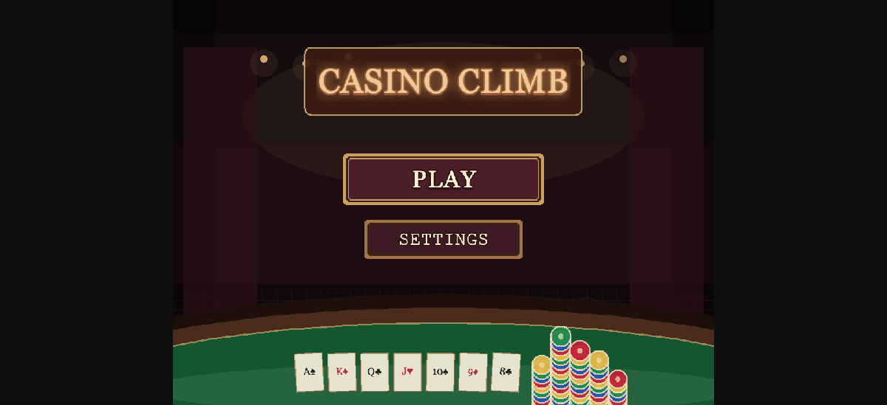
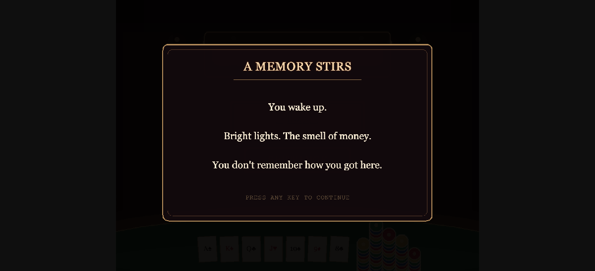
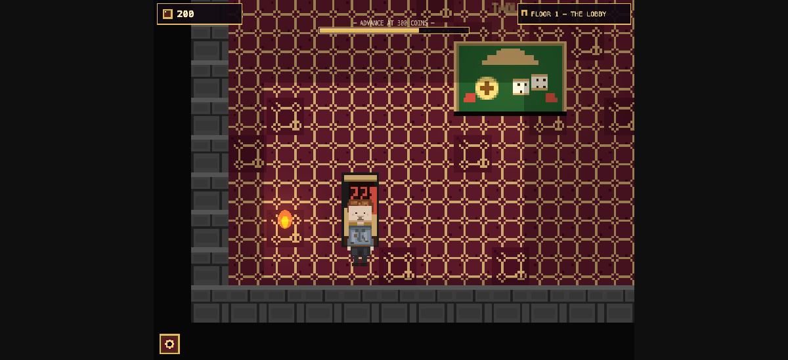
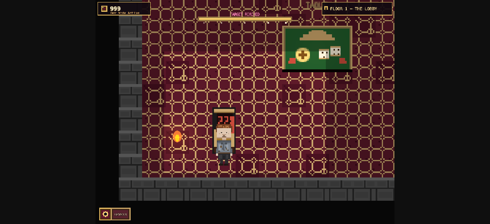

<div align="center">
  
  <h1>Casino Climb</h1>
  <p><strong>Escape the Casino. Climb or lose everything.</strong></p>

  <p>
    <a href="https://zabrodsk.github.io/casino-climb/">
      
    </a>
    
    
    
    
  </p>

  
</div>

---

> You wake up inside a casino dungeon with no memory and 200 coins

Casino Climb is a pixel-art dungeon crawler where every room is a different casino minigame. Walk the floor, find the tables, beat the odds — or go bust trying.

---

## Screenshots

<table>
  <tr>
    <td align="center" width="50%">
      
      <br/><em>Every run starts with a mystery</em>
    </td>
    <td align="center" width="50%">
      
      <br/><em>Explore the dungeon, find the tables</em>
    </td>
  </tr>
  <tr>
    <td align="center" width="50%">
      
      <br/><em>Hit the coin target to unlock the next floor</em>
    </td>
    <td align="center" width="50%">
      
      <br/><em>Neon casino energy meets pixel dungeon grit</em>
    </td>
  </tr>
</table>

---

## What makes it fun

| Hook | Details |
|---|---|
| **Narrative tension** | Atmospheric story beats between floors keep you wondering what's at the top |
| **Arcade betting loops** | Fast, snappy minigames — flip, dice, roulette, blackjack, crash |
| **Run economy** | Your coin stack persists floor to floor — every bet has real consequences |
| **Risk-reward rooms** | The Wheel of Fate: double your stack or lose it all before the stairs |
| **Mobile-first controls** | Virtual joystick + tap buttons — plays great on phone or tablet |

---

## Gameplay

**Start with 200 coins on Floor 1. Hit the target. Climb.**

Each floor is a dungeon room containing casino tables you walk up to and interact with. Beat the floor's coin target to unlock the stairs to the next level.

### Minigames

| Game | Description |
|---|---|
| **Coin Flip** | 50/50. Double or nothing. |
| **Dice Duel** | Roll against the house. Pick your bet size. |
| **Roulette** | Full betting table — straight-up, dozens, outside bets, column bets. |
| **Blackjack** | Classic 21. Hit, stand, bust. |
| **Crash** | Watch the multiplier climb. Cash out before it crashes. |
| **Wheel of Fate** | High-risk bonus wheel before the stairs — spin for glory or despair. |

### Floor targets

| Floor | Name | Target |
|---|---|---|
| 1 | The Lobby | **300 coins** |
| 2 | The Crash Hall | **350 coins** |
| 3 | The Blackjack Parlor | **400 coins** |

---

## Controls

**Desktop**
- Move: `WASD` or Arrow keys
- Interact with tables: walk up and press `E` / click
- Minigames: mouse / pointer

**Mobile**
- Move: virtual joystick (bottom-left)
- Interact / bet: tap buttons (bottom-right during crossing runs)
- All minigames: tap

---

## Run it locally

```bash
npm install
npm run dev
```

Dev server runs at `http://localhost:8080`.

```bash
npm run build   # Production build → dist/
```

---

## Stack

- **[Phaser 3](https://phaser.io/)** — game engine (Canvas + WebGL, Safari-safe)
- **TypeScript** — all game logic
- **Vite** — dev server and bundler
- **GitHub Actions → GitHub Pages** — CI/CD

## Project structure

```
src/
  scenes/    Dungeon + all casino minigame scenes
  games/     Core game mechanics (flip, dice, blackjack…)
  state/     Run state — coins, floor, active effects
  ui/        HUD, virtual joystick, theming
  data/      Floor config and reward tables
public/
  assets/    Sprites, tilemaps, audio
```

---

## License

MIT
